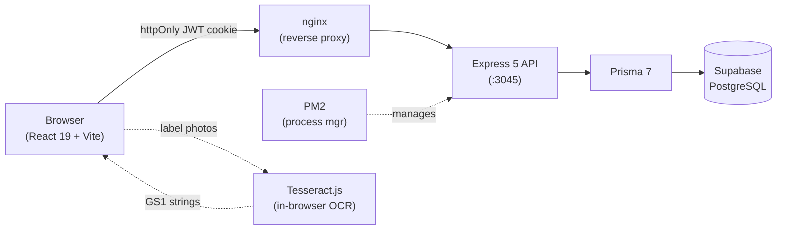

# Nail Tracker — v3.47

> Inventory, transfer, and usage tracking for Summa Orthopaedics surgical nail implants.

---

## Architecture



**Key flows:**
- GS1-128 barcodes (AI 01 GTIN · AI 10 lot · AI 17 expiry) are scanned or OCR-read in the browser and resolved against the product catalog before the server ever sees them.
- All writes go through Express controllers → Prisma transactions → Supabase.
- JWT tokens live in `HttpOnly; SameSite=Lax` cookies; no token is ever stored in `localStorage`.

---

## Prerequisites

| Tool | Version |
|---|---|
| Node.js | ≥ 20 |
| npm | ≥ 10 |
| PostgreSQL | via Supabase (cloud) or local |
| `psql` / Supabase SQL Editor | for migrations |

---

## Quick Start (local development)

```bash
# 1. Clone
git clone https://github.com/phillyshah/nailtracker.git
cd nailtracker

# 2. Environment
cp .env.example .env          # then fill in the 6 required values (see table below)

# 3. Install
npm install

# 4. Database migrations
#    Run the SQL blocks from CHANGELOG.md in the Supabase SQL Editor
#    (or apply them to your local Postgres instance with psql).

# 5. Generate Prisma client
npx prisma generate --schema=server/prisma/schema.prisma

# 6. Start dev servers (two terminals)
npm run dev:server             # Express API on :3045
npm run dev:client             # Vite HMR on :5173 (proxies /api → :3045)
```

Open `http://localhost:5173` — log in with the admin password set in `.env`.

---

## Environment Variables

Create `server/.env` (the server reads from there; Vite's proxy uses the running server):

| Variable | Description |
|---|---|
| `DATABASE_URL` | Supabase pooled connection string (`postgresql://...?pgbouncer=true`) |
| `DIRECT_URL` | Supabase direct connection string (used by Prisma migrations) |
| `JWT_SECRET` | Long random string — sign/verify session tokens |
| `ADMIN_PASSWORD` | Bootstrap password for the built-in admin account |
| `PORT` | Port the Express server listens on (default `3045`) |
| `NODE_ENV` | `development` or `production` |

---

## Project Structure

```
NailTracker/
├── client/                  # React 19 + Vite + Tailwind CSS 4 SPA
│   └── src/
│       ├── api/             # Typed fetch wrappers for every server endpoint
│       ├── components/      # Shared UI (Button, SuccessCard, ExpiryBadge, …)
│       ├── context/         # AuthContext, NotificationContext
│       ├── hooks/           # useToast, useDebounce
│       ├── pages/           # Top-level route components
│       │   └── labs/        # TrackerLabs beta features (admin-only)
│       ├── utils/           # parseGS1, gtin-map, ocrBarcode, transferStaging, …
│       └── data/            # changelog.ts (in-app What's New)
├── server/                  # Express 5 + Prisma 7 API
│   └── src/
│       ├── controllers/     # Route handlers (one file per resource)
│       ├── middleware/       # auth, roles
│       ├── routes/          # Express routers
│       └── utils/           # parseGS1, usageMatch, prisma client
│   └── prisma/
│       └── schema.prisma    # Database schema
├── tsconfig.base.json       # Shared TS compiler options (strict + extras)
├── eslint.config.js         # ESLint flat config (security rules + TS recommended)
├── package.json             # Root — workspace scripts
└── CHANGELOG.md             # Dated release notes
```

---

## Available Scripts

Run from the **repo root** unless noted.

| Script | What it does |
|---|---|
| `npm run dev:server` | Start Express in watch mode (tsx watch) |
| `npm run dev:client` | Start Vite dev server with HMR |
| `npm run build` | Compile server (tsc) + bundle client (vite build) |
| `npm run lint` | ESLint across both workspaces |
| `npm run typecheck` | TypeScript type-check (client + server, no emit) |
| `npm test` | Run all Vitest suites (client + server) |
| `npm run db:migrate` | Prisma migrate dev (local only) |
| `npm run db:seed` | Run `server/prisma/seed.ts` |

---

## Testing

```bash
npx vitest run          # run all 229 tests from repo root
```

Tests live alongside the code they cover (`.test.ts` suffix). Logic is extracted into pure helpers that are tested without React or a database — no component test infrastructure is needed. Both the client and server suites must be green before pushing.

---

## Linting & Type-Checking

```bash
npm run lint            # zero errors required before merging
npm run typecheck       # must pass (client + server)
```

ESLint is configured with:
- `@eslint/js` recommended + `typescript-eslint` recommended
- **Security rules** (hard errors): `no-eval`, `no-implied-eval`
- `@typescript-eslint/no-explicit-any` downgraded to `warn` — `any` is sometimes unavoidable at Prisma/Express boundaries

TypeScript is set to `strict: true` plus `noImplicitReturns` and `noFallthroughCasesInSwitch`.

---

## Database

### Schema overview

| Model | Purpose |
|---|---|
| `User` | Accounts (admin / user / distributor roles) |
| `Distributor` | Sales rep / field accounts that hold inventory |
| `InventoryItem` | One physical unit; soft-deleted via `deletedAt` |
| `AssignmentHistory` | Full movement audit trail for every unit |
| `Transfer` | Batch move record (`TRF-YYYYMMDD-NNNN`) |
| `UsageTicket` | Usage event (consumption) |
| `Bank` | Curated kit — named collection held by a distributor |
| `ParLevel` | Reorder threshold per SKU or product category |
| `AuditSession` | Cycle count session (`AUD-YYYYMMDD-NNNN`) |
| `OcrTrainingSample` | Admin-uploaded label images for OCR training |
| `OcrAlias` | Confirmed OCR corrections (token → canonical REF) |

### Migrations

Migrations are applied as **raw SQL in the Supabase SQL Editor** — the Prisma CLI does not have direct database access from the VPS. Each CHANGELOG.md entry includes the SQL block needed for that release.

RLS may be enabled on your project; Prisma connects as the table owner (`postgres` role) and bypasses row-level security.

---

## Deployment (VPS)

The live site runs on a VPS managed by PM2 behind nginx.

**Shortcut alias** (add to `~/.bashrc` or `~/.zshrc` on the VPS):

```bash
alias deploy-nail='cd /var/www/summa-inventory && git pull origin main && npm install && npm run build && pm2 restart summa-inventory'
```

**Full manual command:**

```bash
cd /var/www/summa-inventory \
  && git pull origin main \
  && npm install \
  && npm run build \
  && pm2 restart summa-inventory
```

**After a Prisma schema change** (new model or column), regenerate the client before building:

```bash
cd /var/www/summa-inventory \
  && git pull origin main \
  && npm install \
  && cd server && npx prisma generate --schema=prisma/schema.prisma && cd .. \
  && npm run build \
  && pm2 restart summa-inventory
```

> **Auto-deploy is currently OFF.** `.github/workflows/deploy.yml` is set to `workflow_dispatch` (manual "Run workflow" only) because the `VPS_SSH_KEY` secret is not accepted by the VPS. Re-add the `push:` trigger once that secret is fixed.

See `CLAUDE.md` for the full handoff notes and VPS configuration details.

---

## Key Architecture Decisions

- **JWT in httpOnly cookies** — tokens never touch JavaScript, preventing XSS theft.
- **Soft deletes** — `InventoryItem.deletedAt` preserves history; deleted items can be re-added by scanning again.
- **GS1-128 barcodes** — AI 01 (GTIN 14 digits) + AI 10 (lot, variable) + AI 17 (expiry YYMMDD). Non-sterile items also carry AI 11 (production date) which the parser skips cleanly.
- **Distributor role scoping** — a distributor account sees only its own stock; all reports, cycle counts, and transfers are pre-filtered server-side.
- **TrackerLabs beta gate** — admin-only (`AdminRoute` + `buildMoreGroups`) hub at `/labs` for experimental features (Par Levels, Cycle Count, Audit History, OCR Training, Backup, Who Has What).
- **In-browser OCR** — Tesseract.js reads printed REF/lot/expiry from implant stickers (no barcode). Multiple stickers per photo are all parsed; a persisted alias overlay from admin-confirmed corrections improves accuracy over time.
- **Barcode format independence** — the server only stores normalized GTIN + lot + expiry; the full GS1 string is assembled and parsed entirely in the browser.
